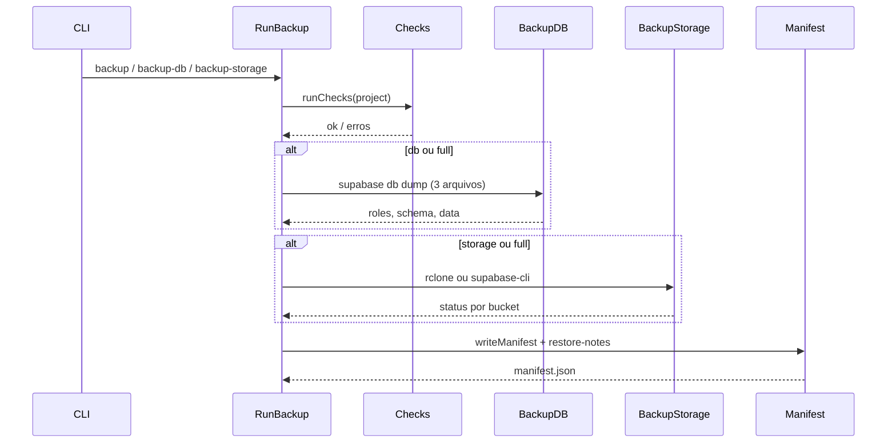

# Arquitetura

## Stack

- **Node.js** + **TypeScript**
- **commander** — CLI
- **dotenv** — variáveis de ambiente
- **execa** — execução de comandos externos
- **fs-extra** — operações de arquivo
- **tsx** — execução em desenvolvimento

## Estrutura de módulos

```txt
src/
  index.ts          # Entry point
  cli.ts            # Definição dos comandos
  config.ts         # Leitura e validação do backup.config.json
  checks.ts         # Verificação de deps e env
  logger.ts         # Log com mascaramento de segredos
  shell.ts          # Wrapper para supabase, rclone, etc.
  backup/
    run-backup.ts   # Orquestração do fluxo
    backup-db.ts    # Dump roles/schema/data
    backup-storage.ts
    manifest.ts     # manifest.json + SHA-256
    restore-notes.ts
  utils/
    mask-secret.ts
    hash-file.ts
    timestamp.ts
    ensure-dir.ts
```

## Fluxo interno do backup



## Backup do banco

Executa três chamadas à Supabase CLI:

```bash
supabase db dump --db-url "$DB_URL" -f roles.sql --role-only
supabase db dump --db-url "$DB_URL" -f schema.sql
supabase db dump --db-url "$DB_URL" -f data.sql --use-copy --data-only
```

Tabelas em `db.excludeTables` recebem `-x <tabela>` em cada comando.

## Backup do Storage

| Modo | Comando | Quando usar |
|------|---------|-------------|
| `rclone` | `rclone copy <remote>:<bucket> <dest>` | Produção / confiável |
| `supabase-cli` | `supabase storage cp -r ss:///<bucket> <dest>` | Fallback experimental |

## Segurança no logger

`logger.ts` e `shell.ts` aplicam `maskConnectionString()` antes de escrever no console ou em `backup.log`. Senhas em URLs Postgres nunca são persistidas em texto claro.

## Extensibilidade

Pontos naturais para evolução futura (fora do escopo v0.1.0):

- Agendamento via cron/Task Scheduler
- Restore assistido com confirmação interativa
- Upload do pacote para S3/GCS
- Notificações (e-mail, webhook) ao concluir backup