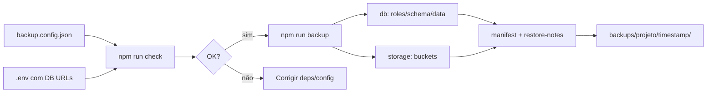

# Visão geral

## Para quem é esta ferramenta

Desenvolvedores e equipes que usam **Supabase** e precisam de backup **local**, **repetível** e **sob controle próprio** — especialmente em homologação, ambientes de teste ou projetos no plano gratuito.

Não substitui o backup gerenciado do plano pago do Supabase; complementa o dia a dia de quem desenvolve e opera a aplicação.

## O problema

### Cenário típico

Você mantém um projeto Supabase com dados reais ou semi-reais em homologação. Antes de:

- rodar uma migration arriscada,
- testar um script de limpeza,
- clonar o ambiente para outro desenvolvedor,
- ou simplesmente dormir tranquilo,

…você precisa de uma cópia recuperável do **banco** e dos **arquivos** no Storage.

### Limitações que o desenvolvedor encontra

| Limitação | Impacto |
|-----------|---------|
| Plano Free sem backup baixável | Sem botão “restaurar de ontem” no painel |
| Dump SQL ≠ arquivos do Storage | PDFs, imagens e uploads ficam de fora do Postgres |
| Conexão Direct só IPv6 em alguns casos | `pg_dump` falha no Windows/rede local |
| `supabase db dump` + Docker | Exige Docker Desktop em muitos setups Windows |
| Restore manual | Ordem correta (roles → schema → data) não é óbvia |

Sem ferramenta, o processo vira uma sequência frágil de comandos copiados de documentação, difícil de repetir em vários projetos.

## A solução

A **supabase-backup-tool** empacota esse fluxo em uma CLI Node.js/TypeScript:

1. Lê projetos de `backup.config.json` e credenciais do `.env`.
2. Testa URLs de banco candidatas (pooler/direct) e escolhe a primeira funcional.
3. Gera dumps do Postgres (`roles`, `schema`, `data`).
4. Copia buckets de Storage configurados.
5. Produz `manifest.json`, `restore-notes.md` e logs auditáveis.

Tudo em uma pasta com timestamp, pronta para arquivar ou restaurar em ambiente separado.

### Pacote gerado em cada execução

```txt
backups/<projeto>/<timestamp>/
  db/
    roles.sql
    schema.sql
    data.sql
  storage/
    <bucket>/
  manifest.json
  restore-notes.md
  logs/backup.log
```

## Uso básico

```bash
# 1. Instalar
npm install

# 2. Configurar
cp backup.config.example.json backup.config.json
cp .env.example .env
# editar .env e backup.config.json

# 3. Validar
npm run check -- --project geral-homologacao --test-db-connection

# 4. Backup
npm run backup -- --project geral-homologacao
```

Comandos alternativos:

- `npm run backup:db` — só banco
- `npm run backup:storage` — só buckets
- `npm run restore:print -- --backup <timestamp>` — roteiro de restore

## Escopo

### O que a ferramenta faz

- Backup lógico do banco via **`pgdump`** (padrão) ou **`supabase-cli`**
- Fallback entre múltiplas connection strings (`dbUrlEnvCandidates`)
- Backup dos bytes dos buckets (`rclone` ou `supabase-cli`)
- Suporte a múltiplos projetos Supabase na mesma instalação
- Validação de dependências e variáveis (`npm run check`)
- Mascaramento de credenciais nos logs
- Detecção de avisos do `pg_dump` (ex.: foreign keys circulares)

### O que a ferramenta não faz

- Agendamento automático (cron) — execução manual nesta versão
- Restore destrutivo automático — apenas instruções em `restore-notes.md`
- Backup gerenciado equivalente ao plano pago
- Exportação completa e garantida de usuários Auth
- Cópia de Storage dentro do dump SQL

## Fluxo de uso



## Próximos passos na documentação

- [Instalação e configuração](./instalacao-e-configuracao.md) — detalhes de `.env`, rclone e engines
- [Comandos](./comandos.md) — referência completa da CLI
- [Restauração](./restauracao.md) — como usar o pacote gerado com segurança